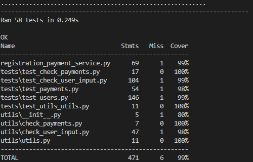
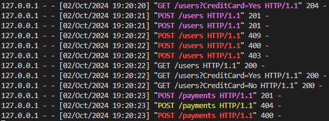

# Registration-Payment-API

A simplistic REST API used for registering users and assessing validity
of payments.

## Installation

### Prerequisites

* Python 3.11.9

### Steps

1. Create a python virtual environment:

    `python -m venv .venv`

2. Activate the virtual environment:

    Windows: `.venv\scripts\activate`

    Unix/MacOS: `source .venv/bin/activate`

3. Install required libraries:

    `pip install -r requirements.txt `

## How to Use

* To run the API:

  `python registration_payment_service.py`

* This will host the API locally on localhost on port 3000

## Testing

### Unit Tests

* To run unit tests:

  `.\run_unit_tests.ps1`

* Optional - Add a flag to automatically open a html coverage report:

  `.\run_unit_tests.ps1 -report`

* Alternatively for Unix/MacOS, run:

  `python -m unittest discover -s tests/`

  #### Example Unit Test Results

  

### Service Tests

* Make sure the API is running.

* Run a selection of service tests:

  `.\service_tests.ps1`

* Alternatively these can be performed by cURL commmands

  #### Example Service Test Results

  

